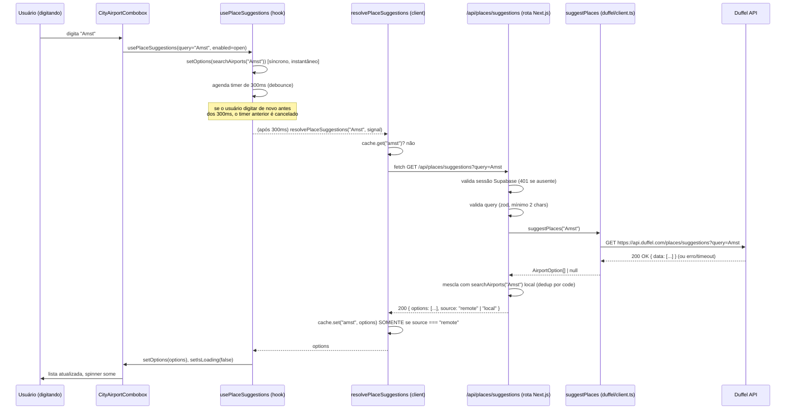

# Fluxos de busca de cidades/aeroportos (origem e destino)

> Refere-se à feature implementada na branch `feature/duffel-places-city-search`
> (worktree `travel-app/.worktrees/duffel-places-city-search`). Documenta como o
> campo de autocomplete usado para "De onde você sai?" (origem) e "Para onde?"
> (destino) — em qualquer trecho ("ida" e, no caso de ida e volta, o mesmo
> componente é usado no sentido inverso para o trecho de volta) — resolve uma
> cidade digitada pelo usuário, com todas as combinações possíveis de
> sucesso/falha entre o array local e a API da Duffel.

## 1. Visão geral

Existem duas fontes de dados para o autocomplete de cidade/aeroporto:

1. **Array local (`CITIES`, em `src/lib/airports.ts`)** — uma lista fixa de ~26
   cidades (principais aeroportos do Brasil + alguns hubs internacionais).
   Busca 100% em memória, sem rede, resultado instantâneo.
2. **Duffel Places API (`GET /places/suggestions`)** — cobre qualquer
   cidade/aeroporto do mundo. Precisa de uma chamada de rede autenticada.

O array local **nunca foi removido nem substituído**. Ele continua sendo:

- o resultado exibido **instantaneamente**, assim que o usuário digita 2+
  caracteres (antes de qualquer resposta de rede chegar);
- o **fallback automático** sempre que a Duffel falha, demora demais, ou não
  está configurada.

Isso garante que o pior caso do novo fluxo é **idêntico ao comportamento
antigo** (busca só no array local) — a Duffel só pode *adicionar* cobertura,
nunca piorar a experiência.

### Camadas envolvidas (do componente até a Duffel)



---

## 2. Componente de UI — `CityAirportCombobox`

Arquivo: `src/components/trip/city-airport-combobox.tsx`

Usado duas vezes por trecho no formulário de busca
(`src/components/trip/search-criteria-form.tsx`):

- **Origem** — label "De onde você sai?" (`slices.{index}.origin`)
- **Destino** — label "Para onde?" (`slices.{index}.destination`)

Em uma viagem **ida e volta** (`tripType: "round_trip"`), o mesmo par
origem/destino é reaproveitado nos dois sentidos pelo motor de busca de voos —
o combobox em si não sabe (nem precisa saber) se está resolvendo a perna de
ida ou de volta. Ele só resolve "texto digitado → código IATA (`AirportOption.code`)".
Em **multi-cidade**, cada trecho adicional (`useFieldArray`) tem seu próprio
par de comboboxes independentes.

Contrato público do componente (**não muda** com essa feature):

```ts
{
  value: string;           // código IATA já selecionado (ou "")
  onChange: (code: string) => void;
  label: string;
  placeholder: string;
  autoFocus?: boolean;
}
```

Internamente:

```ts
const [query, setQuery] = useState(() => findAirportByCode(value)?.label ?? "");
const [open, setOpen] = useState(false);
const { options, isLoading } = usePlaceSuggestions(query, open);
```

- Toda tecla digitada chama `onChange("")` — o código selecionado é
  invalidado até o usuário escolher uma opção da lista de novo (evita
  submeter um código IATA que não corresponde mais ao texto digitado).
- `open` (foco no input) é o `enabled` do hook — sem foco, nenhuma busca roda.
- Um spinner (`isLoading`) aparece dentro do input enquanto a Duffel ainda
  não respondeu; o resultado local já está visível por baixo dele.

---

## 3. Hook `usePlaceSuggestions` — orquestração de UI

Arquivo: `src/lib/use-place-suggestions.ts`

```ts
const DEBOUNCE_MS = 300;

useEffect(() => {
  controllerRef.current?.abort();               // cancela requisição anterior

  if (!enabled || query.trim().length < 2) {
    setOptions([]);
    setIsLoading(false);
    return;
  }

  setOptions(searchAirports(query));             // instantâneo, síncrono
  setIsLoading(true);

  const controller = new AbortController();
  controllerRef.current = controller;

  const timer = setTimeout(() => {
    resolvePlaceSuggestions(query, controller.signal)
      .then((remoteOptions) => {
        setOptions(remoteOptions);
        setIsLoading(false);
      })
      .catch(() => {
        // AbortError de uma requisição superada — ignorado de propósito
      });
  }, DEBOUNCE_MS);

  return () => {
    clearTimeout(timer);
    controller.abort();
  };
}, [query, enabled]);
```

Pontos-chave:

- **Resultado local é síncrono** — roda no mesmo tick do efeito, antes do
  `setTimeout`. Não há "flash" de lista vazia enquanto o array local já tem
  resposta.
- **Debounce de 300ms**: só depois desse intervalo sem nova tecla é que a
  rede é chamada. Digitar "A", "Am", "Ams", "Amst" rapidamente gera **uma
  única** requisição de rede (para "Amst"), não uma por tecla.
- **Cancelamento por superação**: cada nova tecla aborta o `AbortController`
  da tecla anterior (tanto no início do efeito quanto no cleanup). Se uma
  resposta antiga chegasse depois de uma mais nova, ela nunca sobrescreveria
  o estado — porque `resolvePlaceSuggestions` relança `AbortError` nesse
  caso, e o `.catch()` aqui simplesmente ignora.
- Query com menos de 2 caracteres (ou campo sem foco) zera a lista e não
  dispara nenhuma chamada.

---

## 4. `resolvePlaceSuggestions` — cliente HTTP + cache

Arquivo: `src/lib/place-suggestions.ts`

```ts
const cache = new Map<string, AirportOption[]>();

export async function resolvePlaceSuggestions(query, signal) {
  const key = query.trim().toLowerCase();
  if (key.length < 2) return [];

  const cached = cache.get(key);
  if (cached) return cached;

  try {
    const response = await fetch(`/api/places/suggestions?query=${encodeURIComponent(query)}`, { signal });

    if (!response.ok) return searchAirports(query);

    const json = await response.json(); // { options, source? }
    if (!Array.isArray(json.options) || json.options.length === 0) {
      return searchAirports(query);
    }

    if (json.source === "remote") {
      cache.set(key, json.options);   // só cacheia resultado REALMENTE remoto
    }
    return json.options;
  } catch (error) {
    if (error instanceof DOMException && error.name === "AbortError") {
      throw error; // repassa para o hook — nunca mascarado como "falha normal"
    }
    return searchAirports(query);
  }
}
```

- **Cache por query normalizada** (trim + lowercase): digitar "Amsterdam",
  "amsterdam" ou "  AMSTERDAM  " reaproveita a mesma entrada de cache e evita
  requisições repetidas na mesma sessão do navegador (o `Map` vive na
  memória do módulo, compartilhado entre os dois comboboxes — origem e
  destino — enquanto a página não recarrega).
- **Só cacheia quando `source === "remote"`.** Esse é um detalhe importante
  descoberto na revisão final do branch: a rota `/api/places/suggestions`
  responde `200` tanto quando a Duffel funcionou quanto quando ela falhou e
  a rota caiu para o array local — sem esse campo `source`, uma falha
  passageira da Duffel numa cidade que também existe localmente (ex.:
  "Paris") ficaria **permanentemente cacheada como se fosse o resultado
  completo**, escondendo aeroportos globais (ex. Paris CDG vindo da Duffel)
  pelo resto da sessão, mesmo depois da Duffel voltar a funcionar. Com o
  campo `source`, um resultado de fallback local é mostrado normalmente uma
  vez, mas **não fica preso em cache** — a próxima tecla tenta a Duffel de
  novo.
- **Erro de rede/timeout/resposta não-ok** → cai para `searchAirports(query)`
  local, silenciosamente, sem nunca lançar exceção para o hook — exceto
  `AbortError`, que é a única exceção que se propaga (de propósito, para o
  hook saber que aquela resposta não deve mais ser usada).

---

## 5. Rota `GET /api/places/suggestions` — backend

Arquivo: `src/app/api/places/suggestions/route.ts`

```ts
export async function GET(request: Request) {
  const supabase = createSupabaseServerClient();
  const { data: { user } } = await supabase.auth.getUser();
  if (!user) {
    return NextResponse.json({ error: "Não autenticado." }, { status: 401 });
  }

  const parsed = querySchema.safeParse(searchParams.get("query")); // zod: string().trim().min(2)
  if (!parsed.success) {
    return NextResponse.json({ error: "Parâmetro query inválido (mínimo 2 caracteres)." }, { status: 400 });
  }

  const remoteOptions = await suggestPlaces(parsed.data);

  if (!remoteOptions || remoteOptions.length === 0) {
    return NextResponse.json({ options: searchAirports(parsed.data), source: "local" });
  }

  return NextResponse.json({
    options: mergeWithLocalFallback(remoteOptions, parsed.data),
    source: "remote",
  });
}
```

- **Autenticação primeiro** (mesmo padrão de `/api/flights/search`): sem
  sessão Supabase válida → `401` antes de qualquer outra checagem, mesmo que
  a query também seja inválida (auth tem prioridade sobre validação).
- **Validação depois**: query com menos de 2 caracteres (após `trim`) → `400`.
- **`suggestPlaces` nunca lança** — a rota só precisa tratar dois casos:
  `null`/vazio (fallback local) ou array com itens (mescla com o local).
- **`mergeWithLocalFallback`**: quando a Duffel responde algo, o resultado
  final é `[...remotos, ...locais que não repetem um código já retornado
  pela Duffel]` — ou seja, resultados remotos vêm primeiro, e o array local
  só complementa com cidades que a Duffel não trouxe para aquela busca.
  Dedup é feito por `code` (IATA).

### Chamada real para a Duffel — `suggestPlaces()`

Arquivo: `src/lib/duffel/client.ts`

```ts
const DUFFEL_API_BASE = "https://api.duffel.com";
const PLACES_FETCH_TIMEOUT_MS = 2500; // 2.5s

export async function suggestPlaces(query: string): Promise<AirportOption[] | null> {
  const apiKey = process.env.DUFFEL_API_KEY;
  if (!apiKey) return null;

  try {
    const controller = new AbortController();
    const timeout = setTimeout(() => controller.abort(), PLACES_FETCH_TIMEOUT_MS);

    const response = await fetch(
      `${DUFFEL_API_BASE}/places/suggestions?query=${encodeURIComponent(query)}`,
      {
        headers: {
          Authorization: `Bearer ${apiKey}`,
          "Duffel-Version": "v2",
          Accept: "application/json",
        },
        signal: controller.signal,
        cache: "no-store",
      }
    );
    clearTimeout(timeout);

    if (!response.ok) return null;

    const json = await response.json(); // { data: DuffelRawPlaceSuggestion[] }
    return mapDuffelPlaceSuggestionsToAirportOptions(json.data);
  } catch {
    return null;
  }
}
```

**Requisição HTTP exata enviada à Duffel** (exemplo para `query=Amsterdam`):

```
GET https://api.duffel.com/places/suggestions?query=Amsterdam
Authorization: Bearer duffel_test_...
Duffel-Version: v2
Accept: application/json
```

- Reaproveita a mesma `DUFFEL_API_KEY` já usada por `/api/flights/search` —
  **nenhuma variável de ambiente nova**.
- Timeout de **2.5s** (`PLACES_FETCH_TIMEOUT_MS`), mais curto que o timeout
  de cotação de voo (3s), porque isso é uma busca interativa (typeahead) —
  se a Duffel demorar mais que isso, é melhor cair pro array local do que
  travar a digitação do usuário.
- `suggestPlaces` **nunca lança exceção**, para nenhum tipo de falha:
  - `DUFFEL_API_KEY` ausente → `null` (sem tentar a chamada)
  - resposta HTTP não-ok (4xx/5xx da Duffel) → `null`
  - timeout (2.5s estourado, `AbortController` aciona) → `null`
  - qualquer outro erro de rede/parsing → `null` (capturado pelo `catch`)
- Um retorno de `null` para a rota significa exatamente "trate como se a
  Duffel não existisse agora — use o array local".

### Mapeamento da resposta da Duffel — `mapDuffelPlaceSuggestionsToAirportOptions`

Arquivo: `src/lib/duffel/map-place.ts`

A Duffel retorna, para cada sugestão, um objeto que pode ser:

- **`type: "airport"`** — um aeroporto específico, já no nível raiz do array
  (`iata_code`, `name`, `city_name`, `latitude`, `longitude`).
- **`type: "city"`** — uma cidade, que traz dentro de si um array
  `airports: [...]` (0, 1 ou vários aeroportos daquela cidade).

O mapeamento:

- Para `type: "airport"`: vira uma opção direta —
  `{ code: iata_code, label: "${city_name ?? name} (${iata_code})", sublabel: name, lat, lng }`.
- Para `type: "city"`: **expande** em uma opção por aeroporto dentro de
  `airports[]` — cada aeroporto vira `{ code, label: "${nome da cidade} (${code})", sublabel: nome do aeroporto, lat, lng }`.
  Se o aeroporto aninhado não tiver `latitude`/`longitude` próprios, usa as
  coordenadas da cidade-mãe como fallback; se nem a cidade tiver, usa `0`.
- **Lugares sem `iata_code`** são descartados (não tem como virar uma opção
  selecionável — o formulário trabalha só com códigos IATA).
- **Deduplicação por `code`**: se o mesmo código IATA aparecer mais de uma
  vez na resposta (ex. um aeroporto no nível raiz E o mesmo código aninhado
  dentro de uma cidade diferente), só a **primeira ocorrência** é mantida —
  isso evita `key` duplicada na lista React e resultados repetidos na UI.

---

## 6. Array local — `CITIES` / `searchAirports()`

Arquivo: `src/lib/airports.ts`

- ~26 cidades fixas (a maioria no Brasil, mais alguns hubs internacionais:
  Nova York, Miami, Buenos Aires, Lisboa, Londres, Paris, Madri, Frankfurt,
  Tóquio, Santiago, Bogotá, Cidade do México, Toronto, Dubai, Joanesburgo,
  Abuja...).
- `searchAirports(query)` normaliza a query (remove acentos via `NFD`,
  minúsculas, trim) e faz um `includes()` contra
  `"${cidade} ${país} ${código} ${nome do aeroporto}"` normalizado da mesma
  forma — ou seja, busca por cidade, país, código IATA ou nome do aeroporto,
  todos sem diferenciar maiúsculas/acentos.
- Retorna instantaneamente (sem `async`, sem I/O) — é essa função que dá o
  resultado que aparece **antes de qualquer rede**.
- **Nunca é removida nem substituída** por essa feature — continua a base
  de todo fallback e de todo resultado instantâneo.

---

## 7. Matriz de casos possíveis

A tabela abaixo cobre **toda combinação relevante** entre "a cidade está no
array local?" e "a Duffel respondeu?".

| # | Cidade no array local? | Duffel responde? | O que a rota retorna | O que o usuário vê | Fica em cache? |
|---|---|---|---|---|---|
| 1 | Sim (ex. "São Paulo") | — (ainda não respondeu) | — | Resultado local instantâneo (GRU/CGH), sem esperar rede | — |
| 2 | Sim | Sim, com resultados | `source: "remote"`, lista = remotos + locais não repetidos | Lista da Duffel primeiro, com eventuais aeroportos locais que a Duffel não trouxe | Sim |
| 3 | Sim | Falhou (timeout/erro/sem key/não-ok) | `source: "local"`, lista = só `searchAirports(query)` | Exatamente o resultado local (idêntico ao comportamento antes da feature) | **Não** |
| 4 | Não (ex. "Amsterdam") | Sim, com resultados | `source: "remote"`, lista = só remotos (local não tem nada pra mesclar) | Lista global vinda da Duffel (ex. "Amsterdam (AMS)") | Sim |
| 5 | Não | Falhou | `source: "local"`, lista = `searchAirports(query)` = `[]` | Nenhum resultado (nem erro, nem exceção no console) | **Não** (próxima tecla tenta a Duffel de novo) |
| 6 | Não | Sim, mas array vazio (`data: []`) | Tratado como falha → `source: "local"`, lista = `[]` | Nenhum resultado | **Não** |
| — | Query com < 2 caracteres | — | Requisição de rede nunca é feita (barrado no hook e em `resolvePlaceSuggestions` antes do `fetch`) | Lista vazia | — |
| — | Mesma query normalizada já resolvida com sucesso remoto nesta sessão | — | Não bate na rede — retorna direto do `Map` em memória | Resposta instantânea (sem novo round-trip) | (já estava em cache) |
| — | Usuário digita uma tecla nova antes da resposta da anterior chegar | — | A requisição antiga é abortada (`AbortController.abort()`); `resolvePlaceSuggestions` relança `AbortError`; o hook ignora silenciosamente | Só a resposta da **última** tecla digitada é aplicada ao estado — nunca uma resposta antiga sobrescrevendo uma mais nova | — |
| — | Usuário sem sessão autenticada (cookie Supabase ausente/expirado) | — | `401 { error: "Não autenticado." }` | `resolvePlaceSuggestions` trata `!response.ok` como falha → cai para `searchAirports(query)` local | **Não** |
| — | Query inválida (ex. 1 caractere) chega até a rota mesmo assim | — | `400 { error: "Parâmetro query inválido (mínimo 2 caracteres)." }` (só ocorre se algo chamar a rota direto, pulando a checagem do cliente) | idem acima — trata como falha, cai para local | **Não** |

**Casos "dentro do array" vs. "fora do array" resumidos:**

- **Dentro do array + Duffel OK** → o usuário ganha cobertura extra (linha 2):
  a Duffel pode trazer variações/aeroportos que o array local não tem para
  aquela cidade, e o array local ainda complementa com o que já era
  conhecido.
- **Dentro do array + Duffel falha** → comportamento **idêntico ao anterior
  à feature** (linha 3): só os aeroportos do array aparecem, sem indicação
  de erro para o usuário.
- **Fora do array + Duffel OK** → é exatamente o ganho principal da feature
  (linha 4): cidades nunca antes suportadas passam a aparecer.
- **Fora do array + Duffel falha** → nenhum resultado aparece (linha 5) —
  mesmo comportamento de "cidade desconhecida" que já existia antes (o
  array local sozinho também não encontraria nada).

---

## 8. Constantes e limites

| Constante | Valor | Onde | Motivo |
|---|---|---|---|
| `DEBOUNCE_MS` | `300` ms | `use-place-suggestions.ts` | Evita 1 requisição por tecla digitada |
| `PLACES_FETCH_TIMEOUT_MS` | `2500` ms (2.5s) | `duffel/client.ts` | Busca interativa — mais curto que o timeout de cotação de voo (3s) |
| Tamanho mínimo de busca | `2` caracteres | Combobox, hook, `resolvePlaceSuggestions`, rota (`zod`) | Mesma regra em todas as camadas (defesa em profundidade) |
| `DUFFEL_API_KEY` | (reaproveitada) | `duffel/client.ts:14`, `client.ts:60` | Mesma chave usada por `searchFlights` — nenhuma variável nova |

---

## 9. Segurança

- A rota exige sessão Supabase válida (`auth.getUser()`) antes de processar
  qualquer coisa — sem isso, `401`, igual ao padrão de `/api/flights/search`.
- A query do usuário é sempre passada por `encodeURIComponent` antes de
  entrar na URL (tanto na chamada do cliente para a rota interna quanto na
  chamada da rota para a Duffel) — sem risco de injeção via query string.
- A validação com `zod` (`min(2)`) roda no servidor, não só no cliente —
  mesmo que alguém chame a rota diretamente pulando a UI, o mínimo de
  caracteres é garantido.

---

## 10. Limitações conhecidas (aceitas conscientemente)

Encontradas nas revisões de código deste projeto, registradas aqui para
referência futura — nenhuma bloqueia o funcionamento correto da feature:

- **Sem limite de tamanho no merge remoto+local** (`mergeWithLocalFallback`):
  se um dia tanto a Duffel quanto o array local retornarem listas grandes
  para a mesma busca, a lista final não tem um teto. Não é um problema no
  volume atual de dados.
- **Cache do cliente não é insensível a acento**: `resolvePlaceSuggestions`
  normaliza a chave de cache só com `trim()+toLowerCase()`, enquanto
  `searchAirports` local também remove acentos. Ou seja, `"São Paulo"` e
  `"Sao Paulo"` geram entradas de cache separadas (duas requisições em vez
  de uma) — não afeta a correção do resultado, só a taxa de acerto do cache.
- **Sem deduplicação de requisições concorrentes**: se duas teclas
  disparassem chamadas de rede quase simultâneas para a mesma query
  normalizada (situação rara dado o debounce de 300ms), ambas fariam
  `fetch` em vez de uma reaproveitar a outra em andamento.
